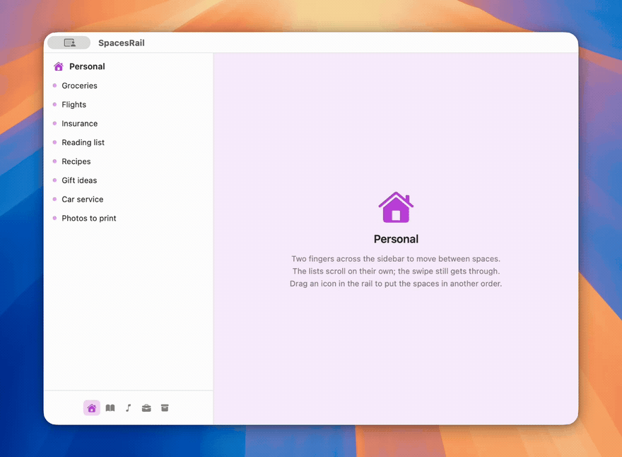

# SpacesRail

A horizontal pager for a macOS sidebar, driven by two finger scroll, with a row
of icons underneath that marks the current page and moves with the gesture.
Used in [Nexion](https://nexion.one) for its spaces; the app depends on this
package rather than on a copy of it.



Requires macOS 14. Depends on SwiftUI and AppKit only.

```swift
.package(url: "https://github.com/nexion-one/SpacesRail", from: "1.0.0")
```

## Demo

```
swift run SpacesRailDemo
```

Five spaces, each containing a `ScrollView`, plus the rail. The scroll views
are there because vertical scrolling under the gesture is the case the event
handling has to get right.

## Usage

Three pieces: a model holding the position, a view applying it, and a monitor
turning scroll events into position changes.

```swift
@StateObject private var swipe = RailSwipeModel()
@State private var pages: [Page] = ...
@State private var active = 0

GeometryReader { geo in
    let width = geo.size.width

    VStack(spacing: 0) {
        SwipingStrip(model: swipe, width: width) {
            HStack(spacing: 0) {
                ForEach(pages) { page in
                    PageView(page).frame(width: width)
                }
            }
        }
        .frame(width: width, alignment: .leading)
        .clipped()

        IconRail(swipe: swipe, items: pages, activeID: pages[active].id) { page in
            Button { select(page) } label: { Image(systemName: page.glyph) }
                .buttonStyle(.plain)
        }
    }
    .background(
        RailSwipeCatcher(
            onDelta: { dx in
                swipe.width = width
                swipe.position = min(max(0, swipe.position - dx / width),
                                     CGFloat(pages.count - 1))
            },
            onSettle: {
                active = Int(swipe.position.rounded())
                withAnimation(.railMove) { swipe.position = CGFloat(active) }
            }
        )
    )
}
```

## API

### `RailSwipeModel`

```swift
@MainActor public final class RailSwipeModel: ObservableObject {
    @Published public var position: CGFloat   // in pages
    public var width: CGFloat                 // for delta to page conversion
}
```

`position` is in pages, not points: integral when parked, fractional mid
gesture, multiplied by the current width at draw time. In points it has to be
recomputed on every container resize, and a missed recompute leaves the strip
offset by the difference.

### `SwipingStrip`

```swift
public struct SwipingStrip<Content: View>: View {
    public init(model: RailSwipeModel, width: CGFloat, @ViewBuilder content: () -> Content)
}
```

Applies `offset(x: -model.position * width)` to its content and nothing else.
The content is a value the caller built before the gesture began, so a position
change moves it rather than rebuilding it. Pages laid out in an `HStack`, each
at the container width.

### `RailSwipeCatcher`

```swift
public struct RailSwipeCatcher: NSViewRepresentable {
    public init(onDelta: @escaping (CGFloat) -> Void, onSettle: @escaping () -> Void)
}
```

`NSViewRepresentable` wrapping `NSEvent.addLocalMonitorForEvents(matching:
.scrollWheel)`. Events are claimed when the pointer is inside the backing
view's bounds and the gesture qualifies as horizontal; claimed events return
`nil` from the monitor and do not reach the view hierarchy.

`onDelta` receives `scrollingDeltaX` per event. `onSettle` fires once when the
gesture ends.

### `IconRail`

```swift
public struct IconRail<Item: IconRailItem, Cell: View>: View {
    public init(
        swipe: RailSwipeModel,
        items: [Item],
        activeID: Item.ID,
        iconWidth: CGFloat = 26,
        gap: CGFloat = 2,
        labelBackground: Color = Color(nsColor: .controlBackgroundColor),
        labelBorder: Color = Color(nsColor: .separatorColor),
        @ViewBuilder cell: @escaping (Item) -> Cell
    )
}
```

Lays the cells out at a fixed pitch, centred while the row fits the available
width and inside a horizontal `ScrollView` when it does not.

Draws `IconRailMark` behind them at `inset + position * (iconWidth + gap)`, so
the mark follows the gesture rather than jumping on selection. Clamped to the
ends rather than wrapping.

Shows `item.name` in a label above the hovered cell, after 120ms of hover.

Cells come from the caller. The rail attaches nothing to them beyond
`.id(item.id)` and the hover handler, so click handling, drag and drop, context
menus and everything else stay outside the package.

### `IconRailItem`

```swift
public protocol IconRailItem: Identifiable {
    var name: String { get }   // hover label
    var tint: Color { get }    // mark fill, at 0.22 opacity
}
```

### `Animation.railMove`

`spring(response: 0.34, dampingFraction: 0.9)`. Used by the settle animation
and available for the caller's own transitions, so selection and swipe share a
curve.

## Event handling notes

**Why a window monitor.** A SwiftUI gesture does not receive scroll events. A
view in front of the content intercepts clicks; a view behind it never sees the
events, because AppKit delivers `scrollWheel` to the deepest view in the
hierarchy that handles it, and an `NSScrollView` handles it. A local monitor
sees the event before delivery and can decline it.

**Axis detection.** Evaluated once per gesture, at the first event:

```swift
guard abs(dx) > abs(dy) * 1.5, abs(dx) > 0.5 else { return false }
```

Not re-evaluated afterwards. A gesture that acquires a vertical component
partway through stays claimed, otherwise the pager stops mid travel and the
remaining deltas go to the scroll view underneath.

**Momentum.** `event.momentumPhase != []` events are consumed and discarded
while `isTracking || wasTracking`. macOS continues emitting scroll events after
the fingers lift; passing them through scrolls the view underneath after every
swipe. `onSettle` fires on `.ended`, not at the end of the coast.

**Mouse wheel.** No `phase` and no `momentumPhase`, so gesture end cannot be
observed. A trailing 80ms `DispatchWorkItem`, cancelled and rescheduled on each
event, stands in for it.

**Teardown.** The monitor is removed in both `dismantleNSView` and the
coordinator's `deinit`.

## Not supported

- iOS. The event handling is AppKit.
- Vertical rails.
- Keyboard paging: `swipe.position` is settable, so the caller can animate it.
- Item mutation. The rail renders `items` in the given order and does not
  reorder, rename or remove anything.

## Contributions

Reports about input hardware are the most useful thing you can send: this has
only ever run on an Apple trackpad and a wheel mouse. There is no test suite,
so anything touching the gesture has to be checked by hand, and
[CONTRIBUTING.md](CONTRIBUTING.md) has the list to work through.

## License

MIT.
